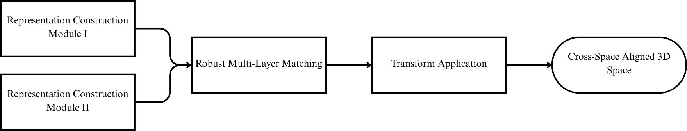
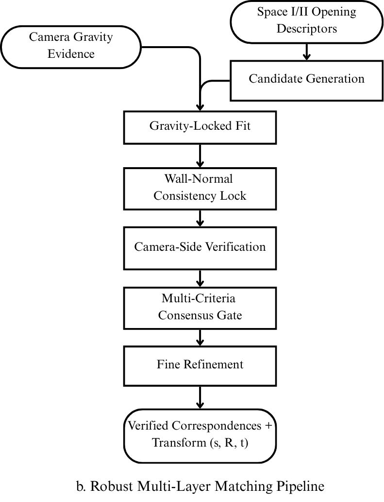
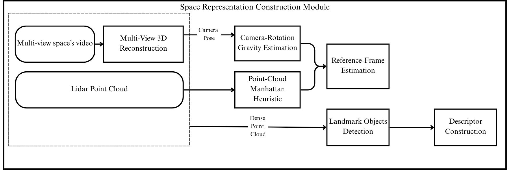
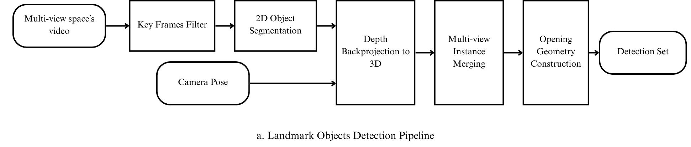

# Kiến trúc pipeline — sơ đồ + giải thích chi tiết

Tài liệu này giải thích 4 sơ đồ kiến trúc chính của pipeline (thư mục
[`assets/`](../assets/)), theo đúng code hiện tại sau khi hợp nhất nhánh
Minh (`gravity_align.py`/`robust_align.py`) làm pipeline chính cho dữ liệu
có camera pose — xem [`CONTRIBUTIONS.md`](../CONTRIBUTIONS.md) mục 11 để
biết bối cảnh/lý do lựa chọn.

Mỗi khối được mô tả theo 4 mục: **Ý nghĩa** (xuất hiện để làm gì) — **Đầu
vào** — **Tính toán chi tiết** — **Đầu ra**.

---

## 1. Kiến trúc tổng thể

| Khối | Ý nghĩa | Đầu vào | Tính toán | Đầu ra |
|---|---|---|---|---|
| **Representation Construction Module I/II** | Xây dựng biểu diễn đầy đủ cho 1 không gian (I = indoor, II = outdoor/không gian liền kề) | Video đa góc quay (hoặc dữ liệu LiDAR) của không gian đó | Xem mục 3 | Reference Frame (hướng trọng lực) + tập Descriptor các landmark |
| **Robust Multi-Layer Matching** | Tìm tương ứng đúng giữa các landmark của 2 không gian, xử lý mọi trường hợp mơ hồ/nhiễu | Descriptor + Reference Frame của cả 2 không gian | Xem mục 2 (6 lớp xử lý) | Cặp tương ứng đã xác minh + transform `(s, R, t)` |
| **Transform Application** | Áp dụng phép biến đổi đã tính vào toàn bộ dữ liệu 3D (không chỉ landmark) | Point cloud đầy đủ không gian I + `(s, R, t)` | Áp trực tiếp `s·R·p + t` lên mọi điểm | Point cloud không gian I đã đưa về hệ toạ độ không gian II |
| **Cross-Space Aligned 3D Space** | Kết quả cuối cùng | Point cloud II (giữ nguyên) + point cloud I đã transform | Ghép 2 point cloud | 1 mô hình 3D thống nhất chứa cả 2 không gian |

**Lưu ý kiến trúc quan trọng**: `Transform Application` không "ước lượng"
gì mới — `(s,R,t)` đã được tính xong hoàn chỉnh ngay trong `Robust
Multi-Layer Matching` (khác với cách làm SGD/Hungarian cũ, nơi transform
được suy ra ở 1 bước Kabsch riêng biệt sau khi có correspondences).

---

## 2. b. Robust Multi-Layer Matching Pipeline

Mỗi "layer" tương ứng với đúng 1 chế độ lỗi thực tế đã gặp và fix trên dữ
liệu thật (xem `CONTRIBUTIONS.md` mục 11 để biết chi tiết 3 bug đã tìm ra
trong `gravity_align.py`).

| Khối | Ý nghĩa | Đầu vào | Tính toán | Đầu ra |
|---|---|---|---|---|
| **Candidate Generation** | Sinh ra các "giả thuyết" tương ứng landmark có thể đúng | Space I/II Opening Descriptors | Gom theo category (door/window), thử mọi tập con kích thước `k = 2..N` (không ép dùng hết mọi landmark — cho phép landmark dư không có cặp) | Danh sách ứng viên tương ứng |
| **Gravity-Locked Fit** | Tính phép biến đổi sơ bộ cho từng ứng viên | Ứng viên + Camera Gravity Evidence | Trọng lực đã biết trước → bài toán xoay 3D rút gọn còn xoay 2D quanh trục đó (azimuth) + tỉ lệ, giải trực tiếp bằng bình phương tối thiểu phức | `(s, R, t)` sơ bộ mỗi ứng viên |
| **Wall-Normal Consistency Lock** | Siết chặt hướng xoay bằng ràng buộc vật lý thật | `(s,R,t)` sơ bộ + normal các landmark đã match | 2 không gian liền kề chung 1 mặt tường → normal tường I sau khi xoay phải ngược hướng normal tường II — chỉnh xoay cho khớp | `(R,t)` đã siết hướng |
| **Camera-Side Verification** | Xác nhận 2 không gian nằm đúng 2 phía đối diện bức tường chung | Vị trí camera 2 không gian + `(s,R,t)` hiện tại | Kiểm tra dấu (bên nào của mặt phẳng tường) của tâm camera 2 bên sau transform | Điểm "đối diện hay không" — loại ứng viên đặt 2 không gian chồng cùng phía |
| **Multi-Criteria Consensus Gate** | Lọc bỏ ứng viên sai bằng nhiều tiêu chí cùng lúc | Sai số vị trí (từng cặp, không chỉ trung bình), sai số kích thước, sai số normal, điểm camera-side | Áp ngưỡng trên từng tiêu chí; xếp hạng ưu tiên ứng viên có NHIỀU cặp khớp nhất trước, sai số làm tiêu chí phụ | Ứng viên tốt nhất (hoặc AMBIGUOUS nếu 2 ứng viên ngang nhau) |
| **Fine Refinement** | Tinh chỉnh lần cuối cho khít | Ứng viên thắng cuộc | Xoay thêm quanh trục normal đã khoá (không phá đồng phẳng tường) để landmark thẳng hàng hơn; dịch theo normal để 2 mặt tường sát nhau | `(s, R, t)` cuối cùng |
| **Verified Correspondences + Transform (s,R,t)** | Kết quả cuối module matching | — | — | Cặp tương ứng đã xác minh + transform hoàn chỉnh |

---

## 3. Space Representation Construction Module

| Khối | Ý nghĩa | Đầu vào | Tính toán | Đầu ra |
|---|---|---|---|---|
| **Multi-view space's video** | Nguồn dữ liệu thô cho không gian có quay video | Chuỗi ảnh/video quay quanh không gian | — | Video/ảnh đa góc |
| **Multi-View 3D Reconstruction** | Dựng lại hình học 3D + quỹ đạo camera từ video 2D — nền tảng cho mọi bước sau | Video đa góc | Chạy DA3/COLMAP: ước lượng pose từng frame (`R,t`, quy ước `X_cam = R·X_world + t`) + depth map từng view + hợp nhất thành point cloud dày đặc | **Camera Pose** (R,t mỗi frame) + **Dense Point Cloud** |
| **Camera-Rotation Gravity Estimation** | Cách chính xác để tìm hướng trọng lực, tận dụng chính dữ liệu pose đã có | Camera Pose | Mỗi frame: `up_i = -R[1,:]` (trục Y ảnh trỏ xuống), chuẩn hoá; trung bình toàn bộ frame → `up`; độ tin cậy `consistency = median(cos(up_i, up))` | `(up, consistency)` |
| **Point-Cloud Manhattan Heuristic** | Phương án dự phòng khi không có pose đáng tin (LiDAR không pose, hoặc `consistency` camera quá thấp) | Dense Point Cloud hoặc Lidar Point Cloud | RANSAC trích mặt phẳng lớn, gom theo hướng normal (Manhattan-world), chọn trục có độ trải (extent) nhỏ nhất trên toàn point cloud làm "lên" | `up` (không kèm điểm tin cậy) |
| **Reference-Frame Estimation** | Chọn RA MỘT `up` duy nhất, ưu tiên phương pháp đáng tin hơn | `(up, consistency)` từ Gravity Estimation + `up` từ Manhattan Heuristic | Bước **chọn (switch), không phải hợp nhất**: `consistency ≥ 0.90` → dùng Camera-Rotation; ngược lại → dùng Manhattan | 1 vector `up` duy nhất, dùng ở bước Matching (khoá azimuth, kiểm tra phía camera) |
| **Landmark Objects Detection** | Tìm vị trí/vùng điểm của từng cửa/mở trong scene | Video + Camera Pose | Xem mục 4 | Cụm điểm 3D thô, mỗi cụm 1 opening đã gộp đa-view |
| **Descriptor Construction** | Đo hình học từng opening thành 1 mô tả gọn — cố tình KHÔNG phụ thuộc `up`/Reference Frame để tránh lỗi lan truyền | Cụm điểm thô | PCA trên cụm: eigenvector nhỏ nhất = normal mặt phẳng (chưa xác định dấu); chiếu điểm lên mặt phẳng, fit hình chữ nhật diện tích nhỏ nhất → 2 cạnh, sắp tăng dần (không gán rộng/cao theo `up`) | `center`, `normal_line`, `extents=(nhỏ,lớn)` — up-free, sign-invariant |

**Vì sao tách `Reference-Frame Estimation` khỏi `Descriptor Construction`?**
Vì `Descriptor Construction` không dùng `up` ở bước đo — chỉ
`Reference-Frame Estimation` mới cần dùng riêng ở bước Matching. Nối
`Reference-Frame Estimation → Descriptor Construction` sẽ ngụ ý sai là
descriptor phụ thuộc hướng trọng lực.

---

## 4. a. Landmark Objects Detection Pipeline

| Khối | Ý nghĩa | Đầu vào | Tính toán | Đầu ra |
|---|---|---|---|---|
| **Multi-view space's video** | Nguồn ảnh gốc | — | — | Chuỗi ảnh/video |
| **Frame Selection (manual/config)** | Không phải mọi frame đều cần chạy segment — chọn ra tập ảnh đại diện | Toàn bộ frame + danh sách chọn trong config | Lọc theo danh sách chỉ định thủ công (`selected_views`/`selected_images`); để trống = lấy tất cả frame | Tập ảnh con sẽ được segment |
| **2D Object Segmentation** | Phát hiện cửa/cửa sổ trên từng ảnh 2D | 1 ảnh đã chọn | Grounding DINO (prompt `"door."`/`"window."`) sinh box → SAM2 sinh mask theo box; lọc NMS trong-nhãn và giữa-nhãn | Mask nhị phân + nhãn + điểm tin cậy, mỗi ảnh |
| **Camera Pose** | Cần biết vị trí/hướng camera của TỪNG ảnh để đưa mask 2D về đúng toạ độ 3D | (từ Multi-View 3D Reconstruction) | — | `R, t` của view đang xét |
| **Depth Backprojection to 3D** | Biến mask 2D thành đám mây điểm 3D thật | Mask 2D + depth map của chính view đó + Camera Pose view đó | Với mỗi pixel `True` trong mask: lấy depth tương ứng, dựng toạ độ camera bằng intrinsics, đưa về world bằng `X_world = R⁻¹(X_cam - t)`; loại điểm depth ngoài `depth_range`; loại instance có `conf` dưới `min_confidence` trước khi backproject | Cụm điểm 3D + nhãn, mỗi instance (1 mask trên 1 view) |
| **Multi-view Instance Merging** | Cùng 1 cửa được thấy từ nhiều ảnh → gộp thành 1 đối tượng, tránh đếm trùng | Cụm điểm 3D từ mọi view | Gộp tham lam: 2 instance cùng nhãn, tâm cách nhau < `merge_distance` (mặc định 0.6) với tâm đang chạy của cụm đã gộp → nhập vào cụm đó | Cụm điểm đã gộp — mỗi cụm = 1 opening vật lý thật |
| **Opening Geometry Construction** | Đo hình học chính xác cho từng opening đã gộp (= `Descriptor Construction` ở mục 3) | Cụm điểm đã gộp (≥150 điểm mới xử lý) | PCA: eigenvector nhỏ nhất = normal mặt phẳng (sign-invariant); chiếu điểm lên mặt phẳng, fit hình chữ nhật diện tích nhỏ nhất → 2 cạnh, sắp tăng dần | `center`, `normal_line`, `extents=(nhỏ,lớn)` mỗi opening |
| **Detection Set** | Kết quả cuối pipeline detection | — | — | Danh sách opening đã đo, sẵn sàng cho `Robust Multi-Layer Matching` |

**Vì sao bỏ bước trích mặt tường (Wall-Plane Extraction) khỏi luồng
chính?** Vì `Opening Geometry Construction` tự đo normal/kích thước từ
chính cụm điểm của nó (PCA + min-area-rectangle), không cần biết trước
mặt tường nào hay hướng "lên" là gì — 1 lỗi trích mặt tường sai (ví dụ
tường gãy thành nhiều mặt do có hốc cửa sổ) sẽ không lan sang bước đo
opening nữa, khác với cách làm cũ (`Detection3D`, đo width/height dựa
vào normal mặt tường gần nhất).
